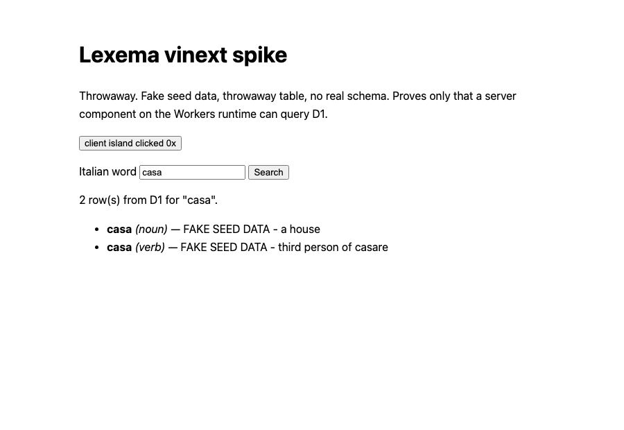

# Spike: does vinext + Cloudflare Workers + D1 actually work?

**Verdict: yes. It worked, and nothing stayed broken.**

Throwaway code. It lives in `spike/vinext/` and is not meant to ship. The table
is fake, the data is fake, and the real schema is owned elsewhere (#3).

Relates to #9 (pick the stack) and #14 (build the search screen).

This page is the findings-and-tradeoffs report. Running the spike is covered in
[`spike/vinext/README.md`](../spike/vinext/README.md); versions, scripts and
other lookup facts live in
[`spike/vinext/docs/REFERENCE.md`](../spike/vinext/docs/REFERENCE.md).

## What was proved

On the real Workers runtime (workerd via wrangler/miniflare, **no deploy, no
Cloudflare account touched**):

- A React server component reads `?q=` from the URL, runs a real parameterised
  D1 query through the `DB` binding, and renders the rows as HTML.
- A route handler (`/api/hello?q=`) does the same and returns JSON.
- A `"use client"` island hydrates. A search box will need this, so it
  mattered. What the script checks is narrower than that sentence sounds: it
  asserts `data-hydrated` flips from `no` to `yes`, which proves the effect
  ran. It does not read the browser console, and React can recover from a
  mismatch and still run the effect. "No console errors" below is a manual
  observation, not something the proof enforces.
- `generateMetadata` sees the query string; `<title>` reflects the search term.
- Accents round-trip: `perché` survives URL → Worker → D1 → HTML.
- `.bind()` really parameterises: `casa' OR '1'='1` returns zero rows.
- Both the dev server (`vinext dev`) and the **built production Worker**
  (`wrangler dev` on the generated config) work. The built path is the one
  that matters, and it was checked separately.



## Finding: the D1 binding comes from the runtime, not from vinext

There is **no vinext helper** for this — no `getCloudflareContext()`, nothing in
`@vinext/cloudflare` (that package is only cache and image adapters). Server
code imports the Workers runtime's own `env`. `@cloudflare/vite-plugin`
provides the same module in dev, so one import works in both dev and
production. That is the whole story, and it is why the escape hatch below is
cheap.

What that looks like, from `spike/vinext/app/db.ts`:

```ts
import { env } from "cloudflare:workers";

export async function findByLemma(lemma: string): Promise<SpikeWord[]> {
  const { results } = await env.DB.prepare(
    "SELECT id, lemma, pos, gloss FROM spike_words WHERE lemma = ? ORDER BY id",
  )
    .bind(lemma)
    .all<SpikeWord>();

  return results;
}
```

Used straight from an async server component:

```tsx
export const dynamic = "force-dynamic";

export default async function Home({ searchParams }: Props) {
  const q = (await searchParams).q ?? "";
  const rows = q ? await findByLemma(String(q)) : [];
  // ...render rows
}
```

The binding is declared once in `wrangler.jsonc`, and `vinext build` copies it
into the generated `dist/server/wrangler.json` untouched. That part just works.

## What broke, and the fix

**1. `create-vinext-app` writes `"latest"` for every dependency.**
Every single entry in the generated `package.json` was `"latest"` — not even a
caret. On a 1.0.0-beta that is a trap: two installs a week apart give you two
different apps. Fixed by resolving once and pinning every direct version
exactly, with the lockfile committed alongside (the resolved versions are
listed in the spike's reference page). If we adopt vinext, pinning has to be a
rule, not a preference. Two honest limits on the claim: the lockfile still
carries upstream peer ranges such as `vite: ^6.1.0 || ^7.0.0 || ^8.0.0`, which
are compatibility metadata and were left alone, and `.nvmrc` pins Node's major
only.

**2. The built Worker could not see the seeded D1 database.**
`pnpm run build` then `wrangler dev --config dist/server/wrangler.json` gave
`D1_ERROR: no such table: spike_words`. Cause: `wrangler` resolves its local
miniflare state directory relative to the **config file**, so the built Worker
looked in `dist/server/.wrangler/` while `wrangler d1 execute --local` had
seeded `./.wrangler/`. Two different sqlite files. Worse, `dist/` is gitignored
and wiped by every build, so that database silently vanishes.

Fix — pass an **absolute** `--persist-to`:

```jsonc
"start": "wrangler dev --config dist/server/wrangler.json --persist-to \"$PWD/.wrangler/state\""
```

A relative `--persist-to .wrangler/state` does **not** work; it is also resolved
against the config file. This cost the most time and is the one thing worth
remembering.

**3. No Workers types in the generated tsconfig.**
`import { env } from "cloudflare:workers"` failed typecheck: `Cannot find module
'cloudflare:workers'` and `Cannot find name 'D1Database'`. The scaffold sets
`"types": ["vinext/types", "node"]` and stops there. Fix: run `wrangler types`,
which writes `worker-configuration.d.ts` with a typed `Env { DB: D1Database }`.
Wired into the typecheck script so it cannot drift:

```jsonc
"typecheck": "wrangler types && tsc --noEmit"
```

**4. pnpm blocked the `workerd` build script.**
`pnpm install` refused to run `esbuild` and `workerd` postinstall scripts.
`workerd` is the Workers runtime, so this is not optional. Fixed with a
`pnpm-workspace.yaml` holding `onlyBuiltDependencies: [esbuild, workerd]`
(pnpm 10 reads it there, not from `package.json`).

**5. Scaffold defaults worth knowing.**
It pulled in TypeScript 7 and Tailwind 4 via `"latest"`. I dropped Tailwind
(noise for a spike) and pinned TypeScript to 5.9.3 rather than take the TS 7
native port as an uncontrolled variable. Neither was actually broken.

## What stayed broken

Nothing. Every problem above has a fix in the repo.

## Not tested

Being explicit about the edges of this spike:

- **Deployment.** Not attempted, on purpose — it needs Huey's Cloudflare
  account and his say-so. Local only.
- **`next/link` client-side navigation** between routes. The spike uses a plain
  GET form, which is a full page load. Worth a follow-up before #14, since a
  result page will probably want soft navigation.
- **ISR / caching / `use cache`.** Set to `none` in the scaffold. A dictionary
  wants caching eventually; that is where a beta is most likely to bite.
- **Images, middleware, server actions, streaming/Suspense.**
- **Load, cold starts, D1 query cost at real dataset size.**

## Honest read: is vinext safe to build on?

For a search box and a result page — **yes, with pinning.** Confidence: high
for the narrow case, medium beyond it.

Why. The spike hit nothing fundamental. Every failure was configuration
(`--persist-to`, missing types, unpinned deps), not a hole in vinext itself.
Server components, async data fetching from a binding, route handlers,
`generateMetadata`, and client hydration all worked on the built Worker, first
or second try. That is the entire surface a dictionary search page needs.
The 538 open issues did not show up in this slice.

The tradeoff. We are on `1.0.0-beta.10` of a project whose own README says it is
not a drop-in Next.js replacement. Two things follow:

1. **Pin everything, exactly.** Already done here. Upgrades become a deliberate
   act with the proof script as the gate.
2. **Stay on the narrow path.** The risk is not rendering a page; it is the
   fancier Next.js features — ISR, `use cache`, middleware, server actions.
   Lexema's first release does not need them. If we later find we do, that is
   where a beta will hurt.

The escape hatch is cheap, which is the real argument. Almost everything here is
plain React plus `env.DB` — the only vinext-specific parts are the App Router
file layout and the build command. If vinext stalls, the D1 access code and the
components carry over to another Workers-compatible React setup with little
rework. We are not deeply locked in.

**Recommendation: proceed with vinext for #9/#14.** Keep exact pins, keep
`pnpm run proof` as a smoke test, and re-spike before adopting ISR or caching.
If someone wants a lower-risk option, the honest alternative is React Router /
Vite on Workers — more stable, but you give up the App Router ergonomics and it
was not evaluated here.
